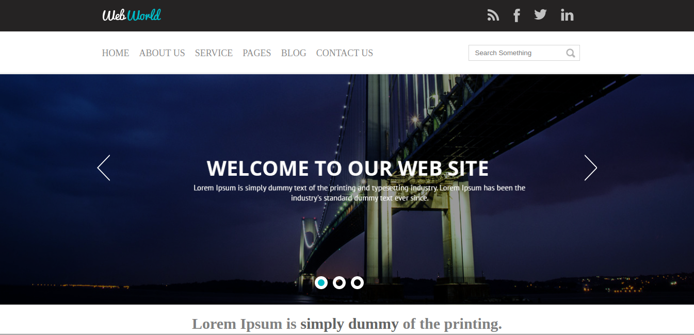
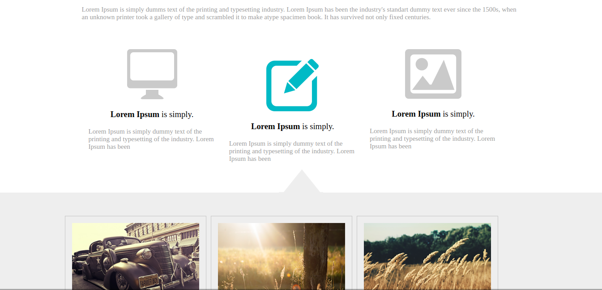
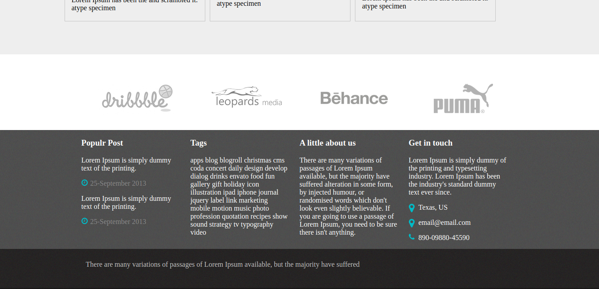

<h1 align="center">Web World</h1>
<p align="center">
  
  
  
  
  

</p>

<p align="center">
  Esse projeto foi desenvolvido durante o curso do canal <a href="https://www.youtube.com/playlist?list=PL4iwH9RF8xHmjxVNJcyNSkVDYNUo6r2BM">Escola Front-end (Criando um site do zero com HTML, CSS e JS)</a>.
</p>

<p align="center">
   <a href="#globe_with_meridians-Tecnologias">Tecnologias</a>
  &nbsp;&nbsp;&nbsp;|&nbsp;&nbsp;&nbsp;
  <a href="#wrench-Como-Utilizar">Como Utilizar</a>
  &nbsp;&nbsp;&nbsp;|&nbsp;&nbsp;&nbsp;
  <a href="#heavy_check_mark-About">About</a>
  &nbsp;&nbsp;&nbsp;|&nbsp;&nbsp;&nbsp;
  <a href="#memo-License">License</a> 
</p>
</p>

## :globe_with_meridians: Tecnologias
<p>Projeto desenvolvido com as seguintes tecnologias:</p>

* HTML5
* CSS3
* JavaScript
* jQuery

## :wrench: Como Utilizar

```
#1 - Clone o repositório
$ git clone https://github.com/ale-mouraboni/web-world.git

#2 - Abra o index.html
```

## :heavy_check_mark: About
<p>Um site bem símples desenvolvido em html5, css3 e um pouco de JavaScript. Esse é um site de estudo feito principalmente para aperfeiçoar minha prática com os códigos.
</br>
Esse projeto foi desenvolvido durante o curso <strong>Criando um site do zero com HTML, CSS e JS do canal Escola Front-end</strong>.
</p>

### Responsive?
[ ] Yes  [x] No

## :memo: License
<p>This project is under the MIT license. See the [LICENSE] for more information.
</p>
